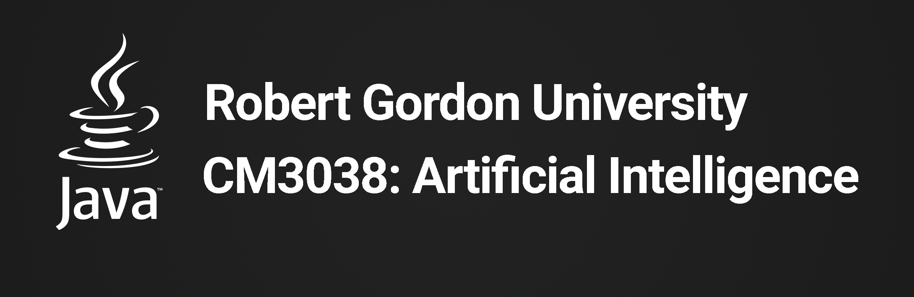

# CM3038: Artificial Intelligence for Problem-Solving Project

The **CM3038: Artificial Intelligence for Problem-Solving Project** is a console application designed to solve the **Bridge
and Torch Problem** using the **A*** Algorithm written in Java.
It supports Static and Dynamic User Input.

## Graded Unit Project Compile-time Dependencies

* [Java](http://www.java.com) (1.8 required;)
* [cm3038](lib/cm3038-coursework/cm3038.jar) (required)git
* [Git](https://git-scm.com) (2.40.0+ optional)

## Installation

The [CM3038: Artificial Intelligence for Problem-Solving installation guides] includes instructions for installing the project as part of a local application.

## Running CM3038: Artificial Intelligence for Problem-Solving Project

### Run-time options:

* `java --classpath "<path/to/lib/cm3038.jar>" <path/to/cm3038.Main>` - Path to entry point file. If unspecified, the current working directory is used.